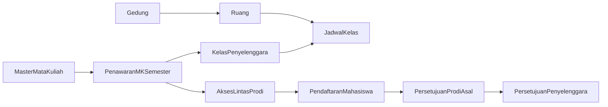

# Rencana Fitur Cross Enrollment

## Model dan alur domain

- Tegaskan pemisahan antara master `Matakuliah`, relasi kurikulum, penawaran semester, dan kelas. Tambahkan entitas `PenawaranMatakuliah` per `semester_prodi + matakuliah`, lalu pertahankan `Kelas` sebagai turunan penawaran yang dapat berjumlah lebih dari satu.
- Penawaran menyimpan status `draft/dibuka/ditutup`, periode daftar, kapasitas/kuota lintas prodi, dan mode akses `semua_prodi/prodi_tertentu`; tabel akses menyimpan daftar prodi yang diperbolehkan ketika mode tertentu dipilih.
- `Krs.semester_prodi_id` tetap menjadi semester-prodi asal mahasiswa, sedangkan kelas/penawaran membawa prodi penyelenggara. Detail enrollment menyimpan status persetujuan asal dan penyelenggara, alasan penolakan, aktor, dan waktu keputusan.

## Backend dan database

- Buat migrasi baru (tanpa mengubah migrasi lama) untuk `gedung`, relasi `ruang.gedung_id`, `penawaran_matakuliah`, `penawaran_matakuliah_prodi`, relasi `kelas.penawaran_matakuliah_id`, serta kolom/status audit cross enrollment pada detail KRS. Tambahkan indeks unik dan foreign key yang menjaga satu penawaran per MK-semester-prodi serta satu akses per prodi.
- Tambahkan/ubah model dan asosiasi di [`backend/src/models`](backend/src/models), terutama `matakuliah.js`, `semesterProdi.js`, `kelas.js`, `ruang.js`, `krs.js`, dan `krsDetil.js`; `Gedung` menjadi master paranoid dan ruang tetap master paranoid.
- Buat stack route → middleware → controller → service → model untuk master Gedung, pengelolaan Ruang, Penawaran MK, jadwal, katalog cross enrollment, daftar/batal, dan dua tahap approval. Gunakan Joi, response helper, transaksi, activity log, dan organization scope.
- Perkuat [`backend/src/services/perkuliahan/jadwal-kelas.service.js`](backend/src/services/perkuliahan/jadwal-kelas.service.js) dengan validasi jam, bentrok ruang, bentrok kelas/dosen, dan kapasitas ruang. Perkuat service KRS agar memeriksa semester yang sama, periode aktif, batas SKS, kapasitas, kuota lintas prodi, eligibility, duplikasi, serta bentrok jadwal secara atomik.
- Tambahkan endpoint ringkasan/detail penawaran yang memasok informasi MK, semester, prodi penyelenggara, daftar kelas/dosen/peserta, CPMK semester, evaluasi, dan dokumen sehingga halaman tidak lagi menampilkan ID KRS mentah atau data nilai global yang tidak sesuai MK/semester.

## Permission dan seeder

- Tambahkan subject baru ke [`backend/src/constants/permissions.js`](backend/src/constants/permissions.js): `Gedung` dan `PenawaranMatakuliah`, beserta CRUD/restore sesuai sifat master; tambahkan aksi khusus seperti `publish`, `enroll`, `cancel-enrollment`, `approve-home`, dan `approve-host` pada subject yang relevan.
- Karena ini domain baru, buat seeder permission baru dan grant awal yang masuk akal: admin universitas mengelola semua; admin fakultas/departemen/prodi dibatasi scope unit; mahasiswa dapat melihat penawaran dan mendaftar/membatalkan miliknya; PA/prodi asal melakukan approval asal; pengelola prodi penyelenggara melakukan approval host.
- Perbarui dokumentasi permission dan pastikan fresh flow `db:migrate` lalu `db:seed:all` tetap berhasil.

## Frontend master dan penawaran

- Tambahkan halaman Master Mata Kuliah, Gedung, dan Ruang menggunakan `DataTable`, modal/drawer/form tervalidasi Zod, `useResourceMutations`, serta tombol yang dibungkus `Can`.
- Rapikan [`frontend/src/pages/perkuliahan/MKSemesterPage.jsx`](frontend/src/pages/perkuliahan/MKSemesterPage.jsx) menjadi daftar penawaran semester, bukan sekadar alias `matakuliah-kurikulum`: filter akademik diterapkan eksplisit, tampilkan status pembukaan, kuota, jumlah kelas/peserta, periode, dan aksi detail/publish/tutup.
- Sediakan form penawaran untuk memilih semester-prodi dan MK dari kurikulum, menentukan periode/kuota, memilih akses semua prodi atau prodi tertentu, lalu membuat satu atau lebih kelas penyelenggara.
- Pada tiap kelas, sediakan pengelolaan dosen dan CRUD jadwal dengan pemilih gedung → ruang, hari, jam mulai/selesai, serta pesan konflik dari backend.

## Detail MK Semester sesuai acuan

- Benahi [`frontend/src/components/mk-semester/MKSemesterLayout.jsx`](frontend/src/components/mk-semester/MKSemesterLayout.jsx) agar route menggunakan ID penawaran dan semester benar-benar menggerakkan query. Bagian informasi menampilkan MK, kode, SKS, prodi, kurikulum, semester, total peserta, serta daftar kelas penyelenggara dan dosennya seperti acuan.
- Pertahankan tepat tiga tab:
  - **Pengaturan CPMK Semester**: pilih/salin CPMK kurikulum ke semester, target minimal, CPL/SCP terkait, sumber nilai, bobot, total bobot, dan pembanding semester sebelumnya.
  - **Evaluasi CPMK Semester**: rangkuman, grafik, nilai peserta; seluruh data difilter oleh penawaran/semester/kelas, menggunakan nama/NIM peserta alih-alih UUID KRS mentah, serta tindak lanjut.
  - **Dokumen Evaluasi**: daftar/upload dokumen dan informasi jenis dokumen, mengikuti periode serta permission.
- Reuse dan rapikan `CPMKSemesterTable`, panel evaluasi, dokumen, `KelasInfoCard`, dan komponen kelas; hindari query nilai global yang saat ini menghasilkan ribuan baris tidak terkait.

## Cross enrollment frontend

- Tambahkan katalog penawaran lintas prodi untuk mahasiswa dengan filter semester, host fakultas/prodi, MK, jadwal, sisa kuota, dan status eligibility; detail menampilkan kelas/jadwal sebelum daftar.
- Tambahkan halaman KRS mahasiswa untuk daftar/batal dan melihat dua status approval. Tambahkan dua antrean approval terpisah bagi prodi asal/PA dan prodi penyelenggara dengan aksi setuju/tolak serta alasan.
- Tambahkan filter ganda `prodi_asal` dan `prodi_penyelenggara` khusus laporan/approval cross enrollment tanpa memaksakan keduanya ke `useAcademicFilter` tunggal.
- Daftarkan resource API, routes, navigation, icon, `PermissionRoute`, dan action-level `Can` di [`frontend/src/services/api.js`](frontend/src/services/api.js), [`frontend/src/routes/index.jsx`](frontend/src/routes/index.jsx), dan [`frontend/src/constants/navigation.js`](frontend/src/constants/navigation.js).

## Pengujian dan verifikasi

- Tambahkan unit test untuk eligibility, kuota, SKS, semester, bentrok jadwal, transisi approval, organization ownership, dan perhitungan evaluasi yang ter-scope.
- Tambahkan integration test untuk CRUD master/penawaran/jadwal, publish, enroll/cancel, dua tahap approval, permission denial, serta race condition kuota.
- Tambahkan test frontend untuk form akses semua/prodi tertentu, tiga tab detail, filter penawaran, konflik jadwal, dan visibility berbasis permission.
- Verifikasi end-to-end pada database fresh: migrate, semua seeder sekaligus, buat gedung/ruang, buka penawaran, buat kelas/jadwal, daftar lintas prodi, approval asal, approval host, lalu pastikan peserta muncul hanya pada kelas dan evaluasi yang benar.